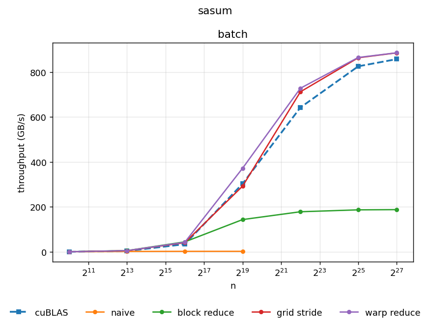
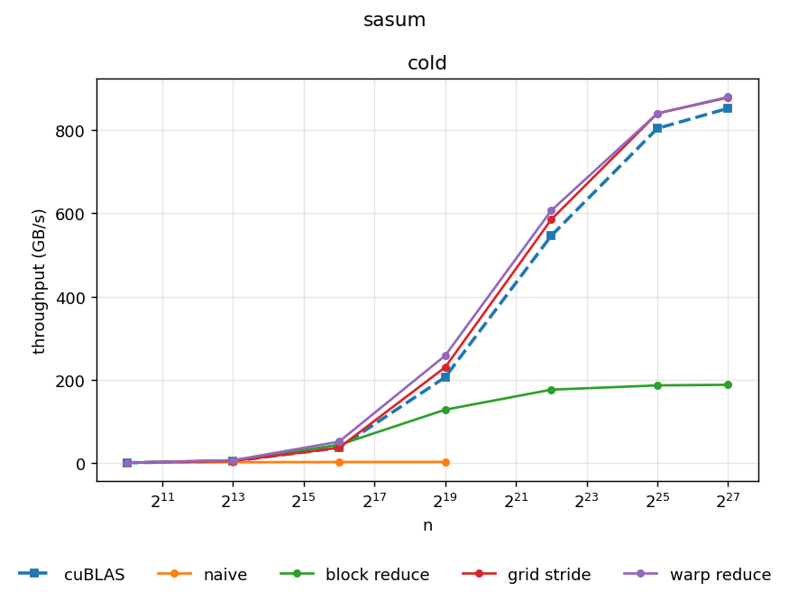

# Single Precision Absolute Sum (SASUM)

## Setup

Let $n$ be a positive integer and $x$ a real vector of length $n$. SASUM is the operation

$$
s \leftarrow \sum_{i=0}^{n-1} |x_i|.
$$

Pseudocode:

```
s ← 0
for i = 0 to n-1 do
    s ← s + |x[i]|
end for
```

The serial loop is trivial. The difficulty is making it parallel: $n$ threads cannot all write
to one accumulator without a race.

## The shape of a SASUM kernel

Every kernel is a map reduce. Each thread maps a slice of $x$ to a partial sum $\sum |x_i|$ held 
in a register, then those partials reduce to one global scalar. 


## Performance ceiling

The GPU we will use is a NVIDIA GeForce RTX 3090. Relevant specs for us are

- Peak float32 throughput: 35.58 TFLOPS
- DRAM bandwidth: 936.2 GB/s

Assume for this section that $n = 2^{27}$.

### Compute

TODO

### Memory

TODO

### Which floor binds?

TODO

#### Roofline

TODO

## Results




## Naive 

TODO

## Block reduce

TODO

## Grid stride loop

TODO

## Warp reduce

TODO
