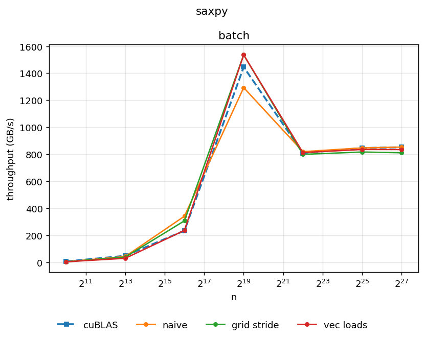
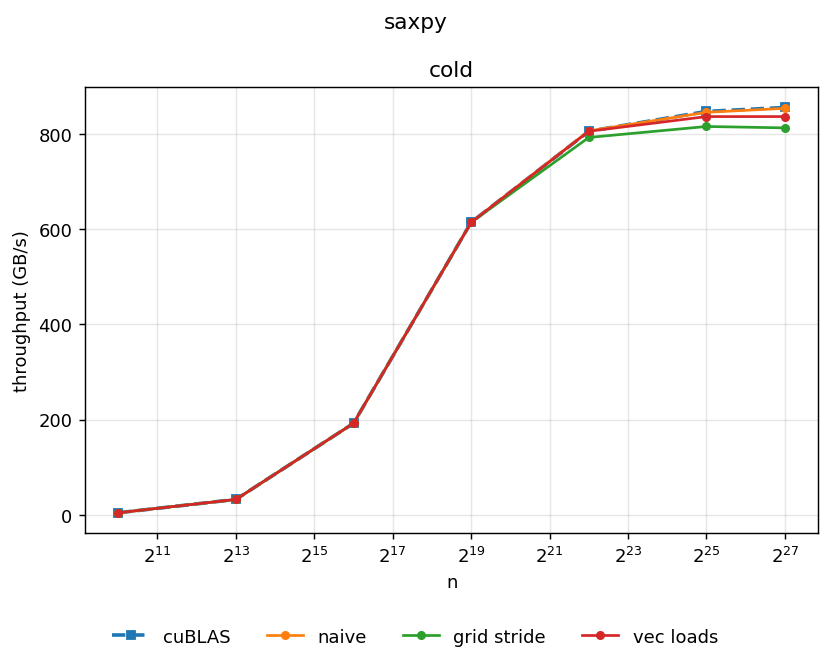

# Single Precision A·X Plus Y (SAXPY)

## Setup

Let $\alpha$ be a real scalar, $n$ be a positive integer and $x$ and $y$ a real vectors of length $n$. 
SAXPY is the operation

$$
y_i \leftarrow \alpha\, x_i + y_i \qquad (0 \le i < n)
$$

Pseudocode:

```
for i = 0 to n-1 do
    y[i] ← α · x[i] + y[i]
end for
```

## The shape of a SAXPY kernel

SAXPY is by definition something that can be implemented in an 'embarrassingly parallel' way: each
output $y_i$ only depends on $x_i$ and $y_i$. 


## Performance ceiling

The GPU we will use is a NVIDIA GeForce RTX 3090. Relevant specs for us are

- Peak float32 throughput: 35.58 TFLOPS
- DRAM bandwidth: 936.2 GB/s

Assume for this section that $n = 2^{27}$.

### Compute

TODO

### Memory

TODO

### Which floor binds?

TODO

#### Roofline

TODO

## Results




## Naive 

TODO

## Grid stride loop

TODO

## Vec loads

TODO
