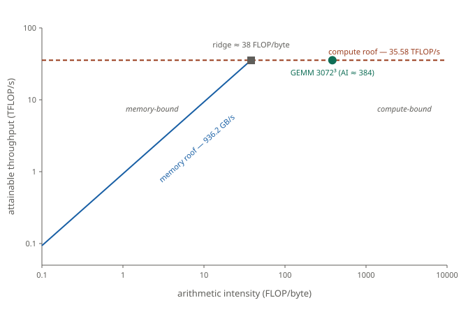
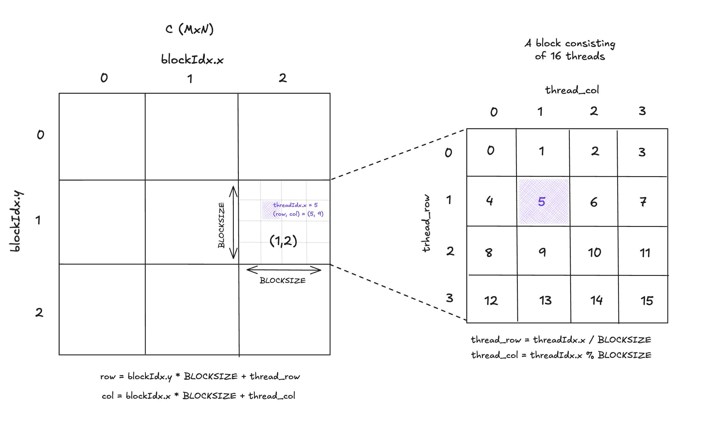

# General Matrix Multiplication (GEMM)

The canonical example for learning CUDA. We mainly follow
[Boehm's article](https://siboehm.com/articles/22/CUDA-MMM).

## Setup

Let $M$, $K$, and $N$ be positive integers, and let $\alpha$ and $\beta$
be real numbers. Given a matrix $A$ of size $M \times K$, a matrix $B$
of size $K \times N$, and a matrix $C$ of size $M \times N$, GEMM is the
operation

$$
C \leftarrow \alpha\, AB + \beta\, C,
$$

or in components,

$$
C_{i,j} \leftarrow \alpha \sum_{k=0}^{K-1} A_{i,k}\, B_{k,j} + \beta\, C_{i,j}
\qquad (0 \le i < M,\, 0 \le j < N).
$$

Pseudocode:

```
for i = 0 to M-1 do
    for j = 0 to N-1 do
        s ← 0
        for k = 0 to K-1 do
            s ← s + A[i,k] · B[k,j]
        end for
        C[i,j] ← α · s + β · C[i,j]
    end for
end for
```

## The shape of a GEMM kernel

Every kernel below computes $C \leftarrow \alpha AB + \beta C$ by decomposing
$C$ into a three-level hierarchy of tiles:

- a *block tile* $\text{BM} \times \text{BN}$ of $C$, computed by one
  thread block from $\text{BM} \times \text{BK}$ and $\text{BK} \times \text{BN}$
  panels of $A$ and $B$ staged in shared memory;
- a *warp tile* $\text{WM} \times \text{WN}$ inside the block;
- a *thread tile* $\text{TM} \times \text{TN}$ inside the warp, held in
  registers.

The naive kernel is the degenerate case $\text{TM} = \text{TN} = 1$ with
no shared memory; each successive kernel realizes one further level of
this hierarchy.


## GPU

The GPU we will use is a NVIDIA GeForce RTX 3090. Relevant specs for us are

- Peak float32 throughput: 35.58 TFLOPS
- DRAM bandwidth: 936.2 GB/s

## Some calculations

Assume for this section that $M = N = K = 3072$.

### Compute

Each entry of $C$ is a dot product of vectors of length $K$, costing
$K$ multiplies and $K-1$ additions, so $2K-1$ FLOPs; there are $MN$
such entries. The $\alpha$ and $\beta$ scalings add a further $3MN$
FLOPs, negligible against $2MNK$. Plugging in numbers,

$$
2MNK = 2 \cdot 3072^3 \approx 58 \text{ GFLOP},
$$

and the compute-bound floor is

$$
\frac{58 \text{ GFLOP}}{35{,}580 \text{ GFLOP/s}} \approx 1.63 \text{ ms}.
$$

### Memory

$A$ and $B$ are each read once, and $C$ is both read (for the $\beta C$
term) and written once: in total

$$
4(MK + KN + 2MN) \text{ bytes}
$$

of float32 traffic. For our size that is $4 \cdot 4 \cdot 3072^2
\approx 151 \text{ MB}$, giving the memory-bound floor

$$
\frac{0.151 \text{ GB}}{936.2 \text{ GB/s}} \approx 0.161 \text{ ms}.
$$

### Which floor binds?

The compute floor exceeds the memory floor by an order of magnitude, so
GEMM at this size is *compute bound* on the 3090. The arithmetic
intensity is

$$
\text{AI} = \frac{2MNK}{4(MK + KN + 2MN)} \approx 384 \text{ FLOP/byte},
$$

well above the 3090's *ridge point*

$$
\frac{35.58 \text{ TFLOP/s}}{936.2 \text{ GB/s}} \approx 38 \text{ FLOP/byte}.
$$

Any workload with intensity above the ridge is compute-bound; below it,
memory-bound.

#### Roofline



The diagonal (slope 1 on log-log axes) is the memory roof; its position
is fixed by DRAM bandwidth. The horizontal dashed line is the peak FP32
throughput. The two meet at the ridge point: arithmetic intensities
above ≈ 38 FLOP/byte are compute-bound, below it memory-bound. GEMM at
$3072^3$ sits at AI ≈ 384, well past the ridge — the target is the
35.58 TFLOP/s ceiling, not the bandwidth diagonal.


## A naive kernel

A CUDA kernel is a function executed once per thread. Threads are
grouped into *warps* of 32, warps into *blocks*, and blocks into a
*grid*; all blocks share a common shape. The 32 threads of a warp
execute in lockstep: the SIMT (Single Instruction, Multiple Threads)
model. A block runs on a single SM; its threads share that SM's shared
memory and may synchronize through it.

The naive kernel computes one entry $C_{i,j}$ per thread:

```cpp
template <int BLOCKSIZE, bool BetaIsZero>
__global__ void
naive_kernel(int M, int N, int K, float alpha, const float *__restrict__ A,
             const float *__restrict__ B, float beta, float *__restrict__ C) {

  // ---- Prologue: thread coordinates -----------------------------------------
  const int row = blockIdx.y * BLOCKSIZE + (threadIdx.x / BLOCKSIZE);
  const int col = blockIdx.x * BLOCKSIZE + (threadIdx.x % BLOCKSIZE);

  if (row >= M || col >= N)
    return;

  float sum = 0.0f;

  // ---- Main loop -----------------------------------------------------------
  for (int k = 0; k < K; ++k) {
    sum += A[row * K + k] * B[k * N + col];
  }

  // ---- Epilogue: αAB + βC store --------------------------------------------
  epilogue::store_result<BetaIsZero>(&C[row * N + col], alpha * sum, beta);
}
```

The launch code for this kernel is as follows.
```cpp
void kernels::sgemm::naive(const SgemmArgs &a) {
  constexpr int BLOCKSIZE = 32;

  dim3 block(BLOCKSIZE * BLOCKSIZE);
  dim3 grid(cuda_utils::ceil_div(a.N, BLOCKSIZE), cuda_utils::ceil_div(a.M, BLOCKSIZE));

  if (a.beta == 0.0f) {
    naive_kernel<BLOCKSIZE, true>
        <<<grid, block>>>(a.M, a.N, a.K, a.alpha, a.A, a.B, a.beta, a.C);
  } else {
    naive_kernel<BLOCKSIZE, false>
        <<<grid, block>>>(a.M, a.N, a.K, a.alpha, a.A, a.B, a.beta, a.C);
  }
  CUDA_CHECK_LAUNCH();
}

```

The two specializations of the kernel exist because the BLAS convention
requires that when $\beta = 0$ the matrix $C$ is *not read*; this permits
$C$ to be uninitialized on entry and avoids the potential pitfall
$0 \cdot \text{NaN} = \text{NaN}$. Hard-coding $\beta = 0$ at compile time
lets the compiler drop the load of $C$ entirely; the runtime branch in the
launcher selects the appropriate specialization. 

First a note about our choice of grid and thread block dimensions. Intuitively, the threads
tile $C$. The grid is a $(N/\text{BLOCKSIZE}) \times (M/\text{BLOCKSIZE})$ matrix of blocks,
and each block is a $\text{BLOCKSIZE}\times\text{BLOCKSIZE}$ matrix. Consider the following image.



The picture shows the correspondence between the grid/block hierarchy and the global coordinates of $C$.
A thread is uniquely identified by the triple `(blockIdx.y, blockIdx.x, threadIdx.x)` and is responsible
for computing exactly one entrie $C_{i,j}$; the figure shows the mapping between the tripe to $(i,j)$. For
ease of drawing we took $\text{BLOCKSIZE}=4$, but one should image it a $32$.

Now consider a single warp: 32 consecutive threads in the block with `threadIdx.x` in $\{0,1,\dots,31\}$.
With $\text{BLOCKSIZE}=32$ the row major linearization gives all of them `thread_row = 0` and `thread_col` running
over $\{0,1,\dots,31\}$. So one warp is exactly one row of the thread block. Translated to global coordinates:
the 32 threads of the warp share the same row index $i$, and their column indices $j, j+1, \dots, j+ 31$ are
32 consecutive integers. The data they collectively need is therefore one row of $A$ and 32 consecutive columns
of $B$.

The crucial fact is that a warp executes in lockstep under the SIMT model. At every iteration $k$ of the inner
loop all 32 threads simultaneously execute the same instruction

```cpp
    sum += A[i * K + k] * B[k * N + j];
```

each with its own $j$. 

All 32 threads in a warp compute the same address `A[i * K + k]` since $i$ and $k$ are identical acress the warp. The 
hardware recognizes this and issues a single load. The value is fetched once and broadcasted to all 32
threads.

The 32 threads compute `B[k * N + j], B[k * N + j+1], ..., B[k * N + j + 31]`. These are 32 consecutive 
values in memory. The hardware coalesces these 32 seperate requests into a single transaction. 

